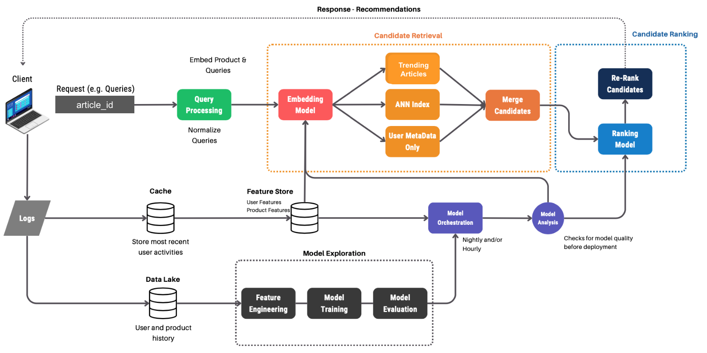

# Two-Stage Recommender System

## Table of Contents
- [Overview](#overview)
- [Current System](#current-system)
- [Proposed Strategy](#proposed-strategy)
- [Future Considerations](#future-considerations)
- [References](#references)

## Overview
This repository contains a prototype content recommendation model developed for an online news platform. The model is designed to provide personalised article recommendations to users based on their past interactions and article metadata. This prototype, when completed, could replace the current model that recommends articles based on click through rate.

## Current System
### Data Ingestion
- Pros:
  - Real-time data collection: immediate collection of session timestamps, article clicks, and system/device versions.

- Cons:
  - Limited features, limited personalisation: despite immediate collection of data, it captures a small number of features.
  - Potential data quality issues: ad-blockers are common among users concerned about privacy and security. These extensions often block JavaScript by default to prevent tracking and enhance security. Therefore, the use of JavaScript for full data ingestion could compromise model training and recommendation due to increased bias from fewer users.

### Modelling
- Pros:
  - Simplicity: easy to implement and maintain.
- Cons:
  - Lack of personalisation: 'one size fits all' approach not tailored to individual user preferences. It might also neglect niche content such as *travel* or *arts*.
  - Static recommendations: weekly updates may not capture rapid user preference changes. Topics such as *geopolitics* and *sports* require more frequent updates.

### Deployment
- Pros:
  - Scalability: Amazon SageMaker enables scalable model training and deployment.

- Cons:
  - Fixed schedule: it might not adapt quickly to content trend changes.
  - Potential downtime: recommendations may be unavailable during retraining and deployment.

### Monitoring
- Pros:
  - Key metrics: `CTR` and `average time spent` provide a foundation for evaluating engagement.

- Cons:
  - Limited metrics: current set of metrics overlooks teh distinction between model (e.g. recall, drift) metrics and business/engagement metrics (*e.g.* user retention, satisfaction, and churn).

**Summary**
The current system provides a basic framework but lacks actual personalisation, interaction data, and monitoring using different types of metrics.

## Proposed Strategy

### Modelling
The prototype is inspired by Covington *et al.* (2016) paper on YouTube recommendations. Researchers used a two-stage approach, efficiently separating candidate generation from ranking outperforming previous matrix factorization approaches, such as the one by Weston *et al*. (2011). The two-stage approach demonstrates high scalability and effectiveness in large-scale settings which are pre-requisites for the news feed platform.

- **Step 1: Similar Article Retrieval**
The first stage uses collaborative filtering to generate candidate recommendations based on user-item interactions. It leverages the article embeddings and nearest neighbour search to identify similar articles.

- **Step 2: Ranking**
In the second stage, the XGBoost model uses features such `candidate_article_id`,	`click_article_id`,	`session_size`,	`click_environment`,	`click_deviceGroup`,	`click_os`,	`click_country`,	`click_referrer_type`,	`clicked	predicted_rank`, and the engineered `time_diff` to predict ranks. The article with the highest rank prediction is then recommended to the user.

- **Model Evalution**
The model's performance was evaluated using *Normalised Discounted Cumulative Gain (NDCG)*. NDCG provides a more direct and reliable measure of how well a recommender system ranks relevant articles at the top, making it more suitable for this project compared with CTR. The use of CTR and average time spent are complementary metrics to gain a holistic understanding of user behaviour.

- **Current Results**:
The prototype achieved an NDCG score of 0.96. However, it clearly shows that it is overfitting. This outcome could have happened primarily due to the limited training dataset and few features. For example, Covington and colleagues (2016) had over 100 features to achieve excellent results.

**NB**: I have prioritised demonstrating a functional model with diverse processing steps over achieving optimal performance and refactored code followed by deployment.

## Future Considerations
- **Enhanced data ingestion**
To address the limitations in data collection, the platform could track user engagement metrics (e.g. scroll depth, likes, comments, shares) and subscription metrics (DAU/MAU ratio) to improve user-item filtering and recommendation. A 'healthy' DAU/MAU ratio (aka stickiness) indicates strong user engagement, and therefore, potential articles to be recommended.

- **Other models**
  - Move from XGBoost to a deep learning model using transformers architecture (Vaswani *et al,* 2017). These models can capture more complex patterns and interactions in the data, are better at handling high-dimensional data and non-linear relationships. There is
  - There is also examples of using Large Language Models (LLM) for recommender systems, see Lin *et al,* (2023). However, LLMs might be a bit unstable with hallucinations, let alone provide accurately reflecting human preferences. In this case, Reinforcement Learning from Human Feedback could help (Rafailov *et al,* 2024).

  These ideas could offer more personalised recommendations and user satisfaction over traditional methods.

- **Low-Rank Quantization**
To improve the efficiency and scalability of the model, implementing low-rank quantization can significantly reduce the computational load and storage requirements. This technique can approximate large matrices used in collaborative filtering, thereby accelerating both training and inference stages without substantial loss in accuracy.

-  **Rolling Updates and A/B Testing**
Implementing rolling updates can reduce downtime by gradually deploying new models, ensuring continuous service availability. A/B testing can evaluate the performance of different model versions in real-world scenarios, providing insights into user preferences and the effectiveness of new features.

Finally, below is an overview of a future system for a recommender system:

### References
Covington, P., Adams, J., & Sargin, E. (2016). Deep Neural Networks for YouTube Recommendations. *Proceedings of the 10th ACM Conference on Recommender Systems (RecSys '16)*, 191-198.

Lin, J., Dai, X., Xi, Y., Liu, W., Chen, B., Zhang, H., ... & Zhang, W. (2023). How can recommender systems benefit from large language models: A survey. arXiv preprint arXiv:2306.05817.

Rafailov, R., Sharma, A., Mitchell, E., Manning, C. D., Ermon, S., & Finn, C. (2024). Direct preference optimization: Your language model is secretly a reward model. Advances in Neural Information Processing Systems, 36.

Vaswani, A., Shazeer, N., Parmar, N., Uszkoreit, J., Jones, L., Gomez, A. N., ... & Polosukhin, I. (2017). Attention is all you need. Advances in neural information processing systems, 30.

Weston, J., Bengio, S., & Usunier, N. (2011). Wsabie: Scaling up to large vocabulary image annotation. In Proceedings of the 22nd International Joint Conference on Artificial Intelligence (IJCAI), 1466-1471.
